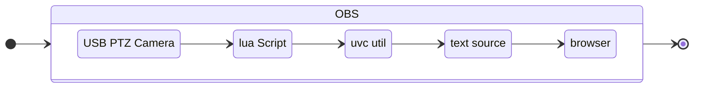

# Moving_Virtual_Background
This project connects a PTZ usb camera and a browser source via an OBS lua script.

This version is MacOS only.  

An example use is creating a moving virtual background by sending the PTZ data to the Photo Sphere Viewer Javascript library.  

### Repositories 

[Photo Sphere Viewer](https://photo-sphere-viewer.js.org/)

[USB Video Capture (UVC) Utility for Mac](https://github.com/jtfrey/uvc-util)

[OBS Lua Script to run UVC commands](https://github.com/marklagendijk/obs-scene-execute-command-script)

